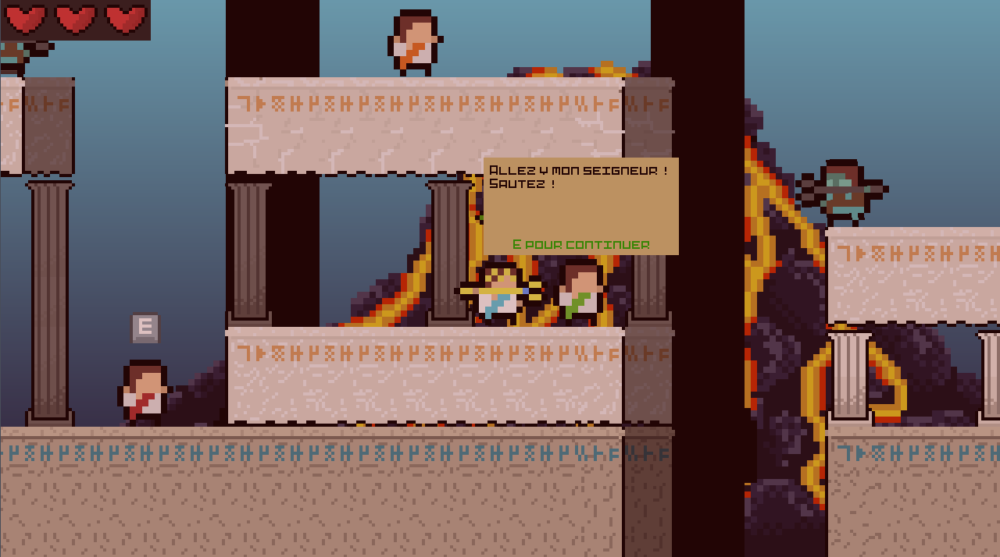

# The Rise Of Atlantica (Archive)

Un jeu de plateforme créé pour la Volcano Game Jam 2020 avec Godot 3 !

Lien itch.io : [The Rise Of Atlantica](https://sirius-alastrot.itch.io/the-rise-of-altantica)

## Credits

- Shader d'eau : [Godot Shaders: How to Make Procedural Animated 2D Water](https://youtu.be/uhMAHpV_cDg) de [Gonkee](https://www.youtube.com/@GonkeeDev).
- Musique : Maxime Triton
- Graphisme : Anthony Rococo
- Code/animations : Pierre Jaffuer
- Game-Design : Tristan Le Lidec